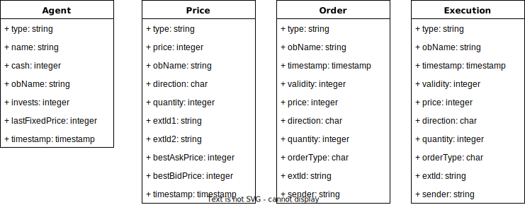

# DBT platform for the Trader ESG Project

## First steps

### Pre-requisites

A Snowflake account and a GitHub account with access to the repository

### Create database in Snowflake Account

You may need to create a database to execute the following scripts.

Check into your snowflake account and create a new database inside a worksheet :

```SQL
CREATE DATABASE TRADER_ACCOUNT_01;
```

### GITPOD Configuration

Start a gitpod environment by opening in your browser the following URL :
https://gitpod.io#https://github.com/Finaxys/trader-esg-dbt

### DBT Configuration

Fill the profile.yml file to provide the corresponding information :

* **DATABASE_NAME** : Snowflake Database created previously
* **USER_NAME** : Snowflake username
* **USER_PASSWORD** : Snowflake username password

```yml
ESG_TRADE:
  outputs:
    dev:
      account: au42629.eu-central-1
      database: **DATABASE_NAME**
      password: **USER_PASSWORD**
      user: **USER_NAME**
      role: DATADAY
      schema: PUBLIC
      threads: 1
      type: snowflake
      warehouse: DATADAY_WH
  target: dev
```

## Exercice 1 - DBT Model

Giving the following class diagram, construct models representing *BRONZE_TABLE_EXEC*. You can take as an example the *BRONZE_TABLE_AGENT* and *BRONZE_TABLE_ORDER* models



You can run your model with

```bash
dbt run
```

or only one model with

```bash
dbt run --select BRONZE_TABLE_AGENT
```

## Exercice 2 - DBT Python

Modify the SILVER_PRICE_ANALYTICS.py to add a new column representing the volume giving quantity and price

Join ESG, E, S and G rating from BRONZE_TABLE_ESG with the BRONZE_TABLE_PRICE